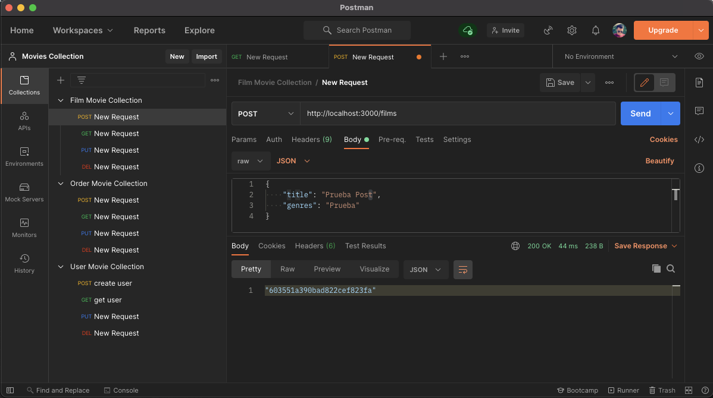
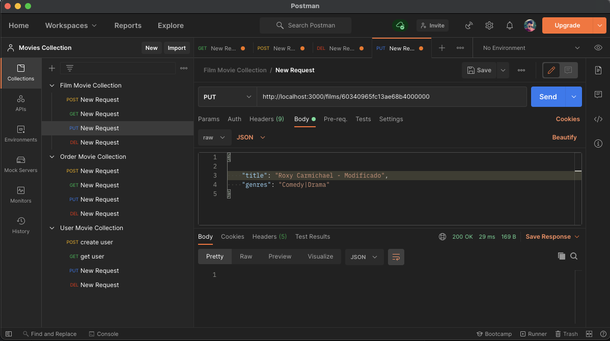
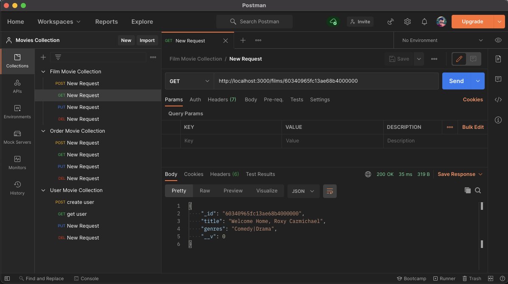
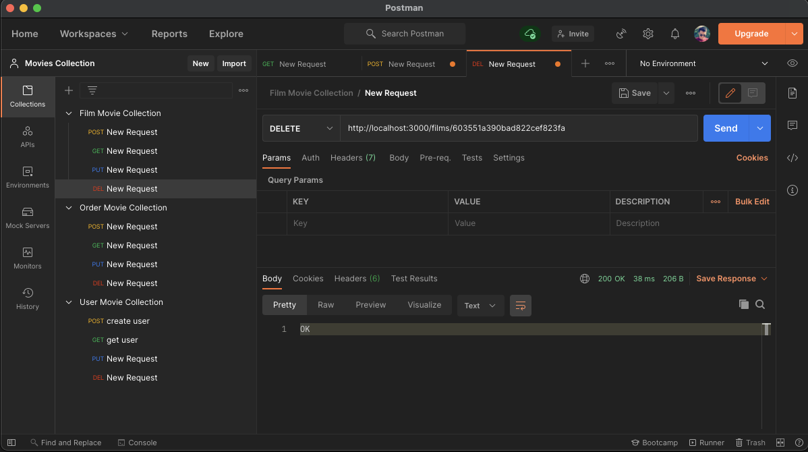

The Film Project
===
  

## Tabla de contenido
[TOC]

## Introducción
Mi primer proyecto creando mi propia API de peliculas siguiendo los pasos **CRUD**, en el cual cuento con los datos de mis peliculas cargadas, usuarios y pedidos que realizo el usuario.

## Herramientas 🚀


## Funcionalidades

Para poder probarlo, necesitas usar postman.

- Si la creación (**POST**) es exitosa, devueve un status 200 y en el body el ID. 
- Si da error, devulve un status 500 y en el body:
```js
    message: 'Server Error: ' + error 
```


- Si la modificación (**PUT**) es exitosa, devueve un status 200 y en el body me devuelve el json del objeto actualizado. 
- Si da error, devulve un status 500 y en el body:
```js
    message: 'Server Error: ' + error 
```


- Si la lectura (**GET**) es exitosa, devueve un status 200 y en el body me devuelve el json del objeto.
- Si no existe un objeto con el **ID** especificado, devolvera un status 404 (Not found).
- Si da error, devulve un status 500 y en el body:
```js
    message: 'Server Error: ' + error 
```


- Si la eliminación (**DELETE**) es exitosa, devueve un status 200. 
- Si da error, devulve un status 500 y en el body:
```js
    message: 'Server Error: ' + error 
```


## Ejecución 🛠️

Para istalar las librerias que utilizo en el proyecto, solo tiene que lanzar:
```bash
    npm i
```
Si no, para:

Iniciar un proyecto con nodejs
```bash
    npm init
```

Libreria para ayudarte a codificar contraseñas
```bash
    npm i bcryptjs
```

Lanzar mongo
```bash
    docker run --rm -p 27017:27017 mongo
```
Luego lanzar app.js
```bash
    node app.js
```
ó
```bash
    npm start
```

